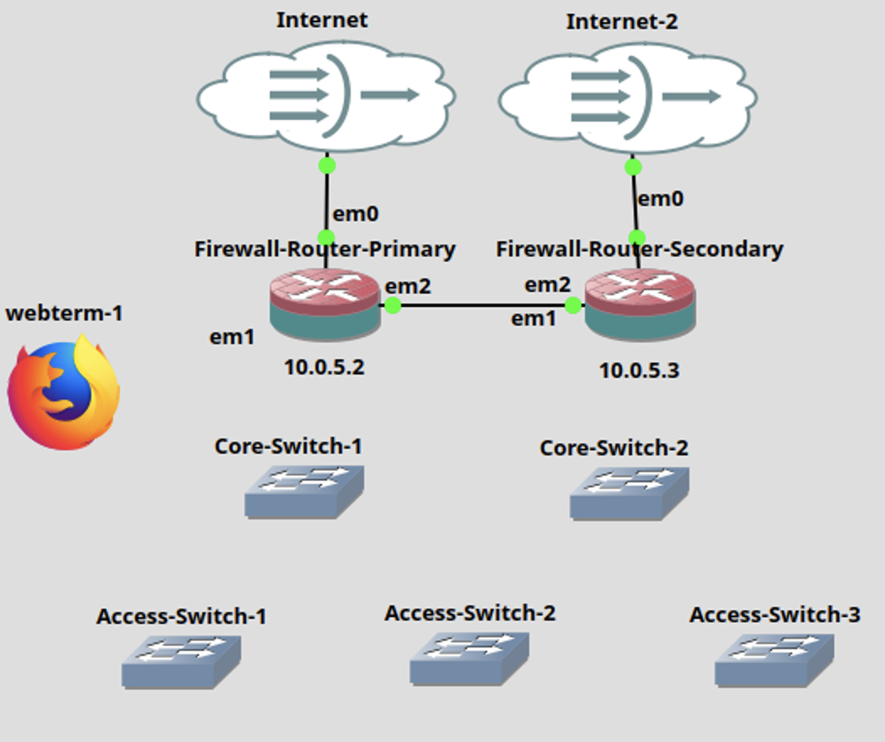
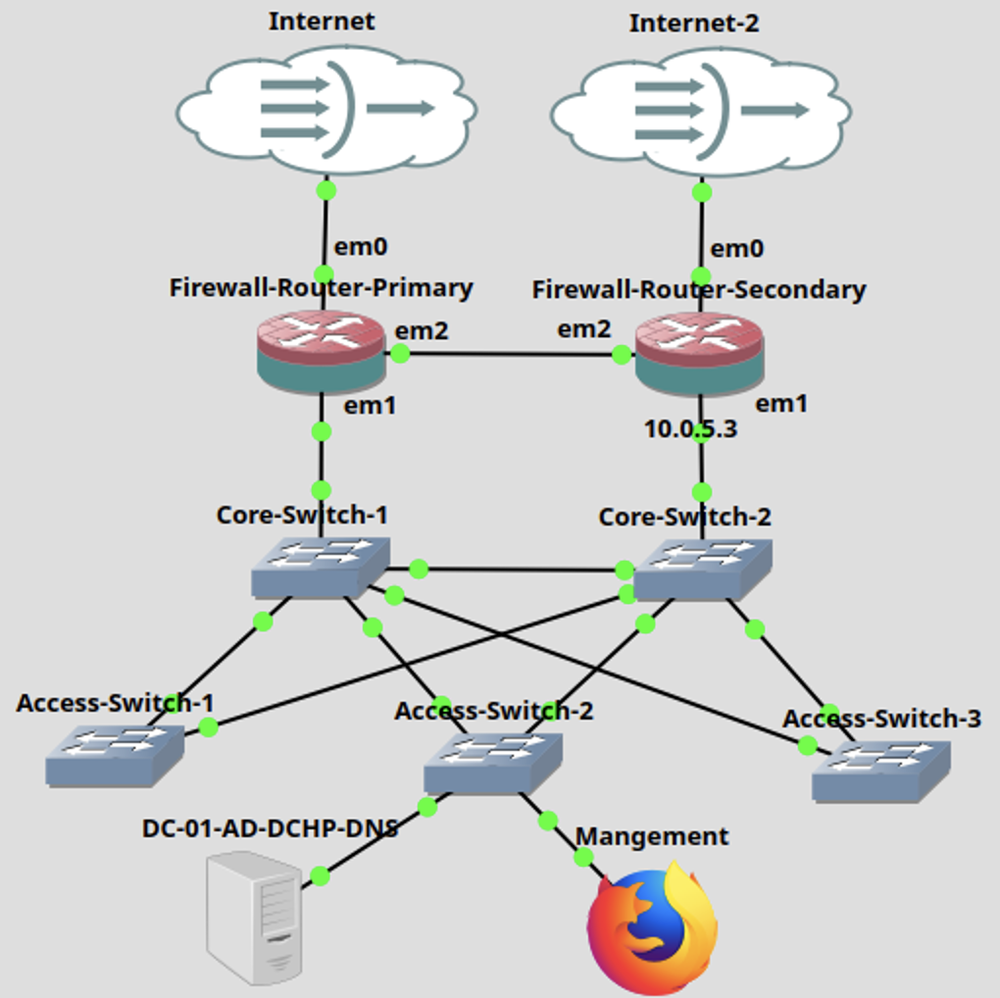

# Deploy & Configure Core and Access Switches

## GNS3 Canvas 



## Set Up the First Core Switch

1. In GNS3, place **5 Open vSwitch** devices on the canvas and rename them.
2. Open the console for **Core-Switch1**.
3. Check the current configuration:
   ```sh
   ovs-vsctl show
   ```
4. Remove all existing bridges:
   ```sh
   for br in $(ovs-vsctl list-br); do ovs-vsctl del-br $br; done
   ```
5. Verify again:
   ```sh
   ovs-vsctl show
   ```
6. Create a new bridge:
   ```sh
   ovs-vsctl add-br br0
   ```
7. Enable STP and set the priority:
   ```sh
	ovs-vsctl set bridge br0 stp_enable=true other-config:stp-priority=4096
   ```
8. Add a trunk port toward **pfSense**:
   ```sh
   ovs-vsctl add-port br0 eth0 trunk=9,10,20,30,40,99
   ```
9. Add a trunk port toward **Core-Switch2**:
   ```sh
   ovs-vsctl add-port br0 eth1 trunk=9,10,20,30,40,99
   ```
10. Add trunk ports toward Access Switches:
    - Access-Switch-1:
      ```sh
		ovs-vsctl add-port br0 eth2 trunk=10,20
      ```
    - Access-Switch-2:
      ```sh
		ovs-vsctl add-port br0 eth3 trunk=9,99
      ```
    - Access-Switch-3:
      ```sh
		ovs-vsctl add-port br0 eth4 trunk=10,30,40
      ```
11. Verify the final configuration:
    ```sh
    ovs-vsctl show
    ovs-appctl stp/show br0
    ```

## Set Up the second Core Switch

Below is an example shell script you can run on **Core-Switch2**. You can also execute each command manually:

[set-up-second-core-switch.sh](/scripts/set-up-second-core-switch.sh)

1. Open the console of **Core-Switch2**.
2. Create a file:
   ```sh
   nano configure_coreSW2.sh
   ```
3. Paste in the script above, then save and exit (Ctrl+X, then Y).
4. Make the script executable:
   ```sh
   chmod +x configure_coreSW2.sh
   ```
5. Run it:
   ```sh
   ./configure_coreSW2.sh
   ```


## Set Up the First Access Switch

Script for the first access switch:

[set-up-first-access-switch.sh](/scripts/set-up-first-access-switch.sh)

1. Open the console for **Access-Switch-1**.
2. Create a file:
   ```sh
   nano configure_accessSW-1.sh
   ```
3. Paste in the script, save, and exit (Ctrl+X, then Y).
4. Make the script executable:
   ```sh
   chmod +x configure_accessSW-1.sh
   ```
5. Run it:
   ```sh
   ./configure_accessSW-1.sh
   ```

## Set Up the Second Access Switch

Script for the second access switch:

[set-up-second-access-switch.sh](/scripts/set-up-second-access-switch.sh)

1. Open the console for **Access-Switch-2**.
2. Create a file:
   ```sh
   nano configure_accessSW-2.sh
   ```
3. Paste in the script, save, and exit.
4. Make the script executable:
   ```sh
   chmod +x configure_accessSW-2.sh
   ```
5. Run it:
   ```sh
   ./configure_accessSW-2.sh
   ```

## Set Up the Third Access Switch

Script for the third access switch:

[set-up-third-access-switch.sh](/scripts/set-up-third-access-switch.sh)

1. Open the console for **Access-Switch-3**.
2. Create a file:
   ```sh
   nano configure_accessSW-3.sh
   ```
3. Paste in the script, save, and exit.
4. Make it executable:
   ```sh
   chmod +x configure_accessSW-3.sh
   ```
5. Run it:
   ```sh
   ./configure_accessSW-3.sh
   ```

## Interconnecting Core and Access Switches



1. Core-Switch-1:
   - `eth0` > Connect to **Firewall-Router-Primary (em3)**
   - `eth1` > Connect to **Core-Switch-2 eth1**
   - `eth2` > Connect to **Access-Switch-1 eth0**
   - `eth3` > Connect to **Access-Switch-2 eth0**
   - `eth4` > Connect to **Access-Switch-3 eth0**
2. Core-Switch-2:
   - `eth0` > Connect to **Firewall-Router-Secondary (em3)**
   - `eth1` > Connect to **Core-Switch-1 eth1**
   - `eth2`, `eth3`, `eth4` > Same pattern as Core-Switch-1 but for second links to the access switches
3. Access-Switch-1, 2, 3:
   - `eth0` > Connect to **Core-Switch-1**
   - `eth1` > Connect to **Core-Switch-2**
4. Connect **Web-Term** to `eth5` on **Access-Switch-2** (tagged VLAN 99).
5. Place a **Windows Server** VM and connect it (for example) to `eth2` on **Access-Switch-2** if desired.

## Configure Web-Term with New Network Settings

1. Right-click **Web-Term** > **Configure**.
2. In **General Settings**, go to **Network Configuration** > **Edit**.
3. Replace the existing static settings with:
   ```sh
   # Static configuration for eth0
   auto eth0
   iface eth0 inet static
       address 10.0.99.10
       netmask 255.255.255.0
       gateway 10.0.99.1
       up echo nameserver 8.8.8.8 > /etc/resolv.conf
   ```

## Turn Off MGMT Interface in pfSense

1. Log in to each pfSense instance (e.g., `10.0.99.2` for Primary, `10.0.99.3` for Secondary).
2. Navigate to **Interfaces > MGMT**.
3. Uncheck **Enable Interface**.
4. Click **Save** and then **Apply Changes**.

## Resources & References

- Open vSwitch Documentation: https://docs.openvswitch.org/