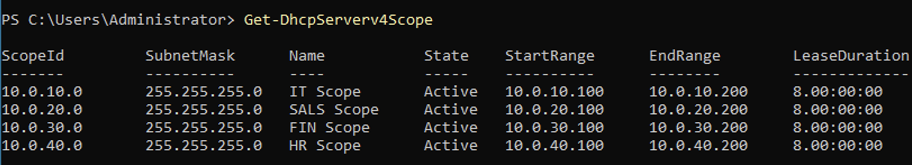
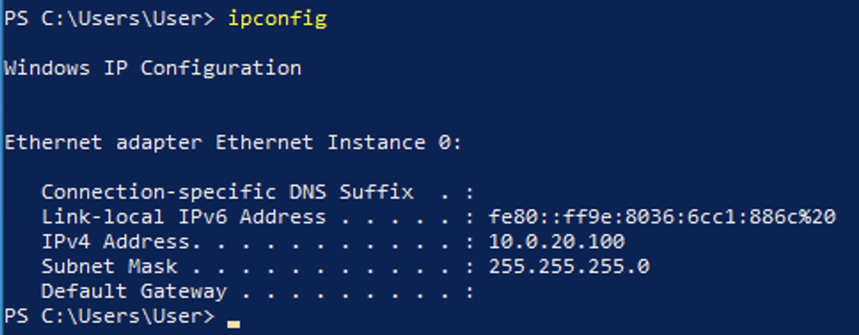

# Configure DHCP Server and DHCP Relay

## Install the DHCP Server

1. **Open PowerShell** with administrative privileges.
2. Install the DHCP server and management tools by running:
   ```powershell
   Install-WindowsFeature DHCP -IncludeManagementTools
   ```

## Authorise the DHCP Server in Active Directory

1. Authorise the DHCP server using the following command:
   ```powershell
   Add-DhcpServerInDC -DnsName "DC01.lab-test.local" -IpAddress 10.0.9.4
   ```
2. Verify the authorisation with:
   ```powershell
   Get-DhcpServerInDC
   ```

## Create DHCP Scopes for VLANs

| VLAN      | Subnet       | DHCP Range                |
| --------- | ------------ | ------------------------- |
| 10 (IT)   | 10.0.10.0/24 | 10.0.10.100 – 10.0.10.200  |
| 20 (SALS) | 10.0.20.0/24 | 10.0.20.100 – 10.0.20.200  |
| 30 (FIN)  | 10.0.30.0/24 | 10.0.30.100 – 10.0.30.200  |
| 40 (HR)   | 10.0.40.0/24 | 10.0.40.100 – 10.0.40.200  |

### Creating Scopes and Setting Options

Run the following PowerShell script with admin privileges to add the scopes and configure the default gateway, DNS server, and domain name for each scope:

[configure-dhcp-scopes-dc-01.ps1](scripts/configure-dhcp-scopes-dc-01.ps1)

> [!NOTE]
> The simplest method is to create a text document, paste the script, save it as a `.ps1` file, and then execute it.

#### Verification

Verify that the DHCP scopes have been created successfully by checking the DHCP management console or running additional PowerShell commands. For reference, see the screenshot and command below:
```sh
Get-DhcpServerv4Scope
```



## Configure DHCP Relay on pfSense

1. Open the primary pfSense web interface at `https://10.0.5.2`.
2. Navigate to **Services > DHCP Relay**.
3. Enable DHCP Relay.
4. In **Downstream Interfaces**, select the following:
   - VLAN_IT
   - VLAN_SALS
   - VLAN_FIN
   - VLAN_HR
5. Set **CARP Status VIP** to `10.0.9.1` (the VIP associated with the DHCP scope).
6. In **Upstream Servers**, enter the IP address `10.0.9.4` (the DHCP server on DC-01).
7. The secondary firewall will automatically inherit these settings via High Availability (HA).

## Test DHCP Functionality

1. On the GNS3 canvas, add a Windows appliance.
2. Connect the appliance to the **eth2** interface on **Access-Switch-1**.
3. Open PowerShell on the Windows appliance and run:
   ```powershell
   ipconfig
   ```
4. Verify that the workstation receives an IP address from the DHCP server.


## Resources & References

- Microsoft DHCP Server Documentation: https://learn.microsoft.com/en-us/windows-server/networking/technologies/dhcp/dhcp-top
- pfSense DHCP Relay Documentation: https://docs.netgate.com/pfsense/en/latest/services/dhcp/relay.html