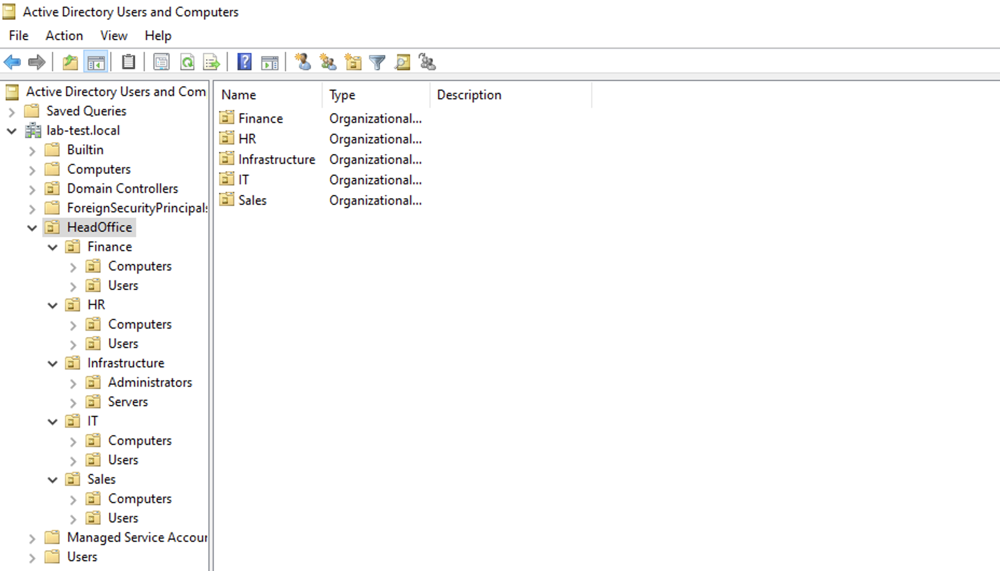

# Configure Organisational Units (OUs)

### OU structure

``` plaintext
DC=lab-test, DC=local
└── OU=HeadOffice
    ├── OU=Infrastructure
    │   ├── OU=Administrators
    │   └── OU=Servers
    ├── OU=IT
    │   ├── OU=Users
    │   └── OU=Computers
    ├── OU=Sales
    │   ├── OU=Users
    │   └── OU=Computers
    ├── OU=Finance
    │   ├── OU=Users
    │   └── OU=Computers
    └── OU=HR
        ├── OU=Users
        └── OU=Computers
```

> [!TIP]
> To generate a tree like the one above, I used: https://www.text-tree-generator.com

## Create Organisational Units

1. In the search bar, type `dsa.msc`.
2. Right-click on the domain `lab-test.local`.
3. Select **New > Organizational Unit**
4. Name the OU **HeadOffice** and click **OK**.
5. Recreate the OU Structure that you see above.

## Final result
