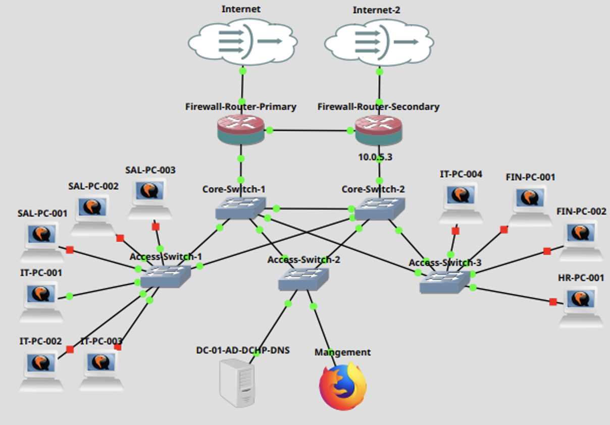
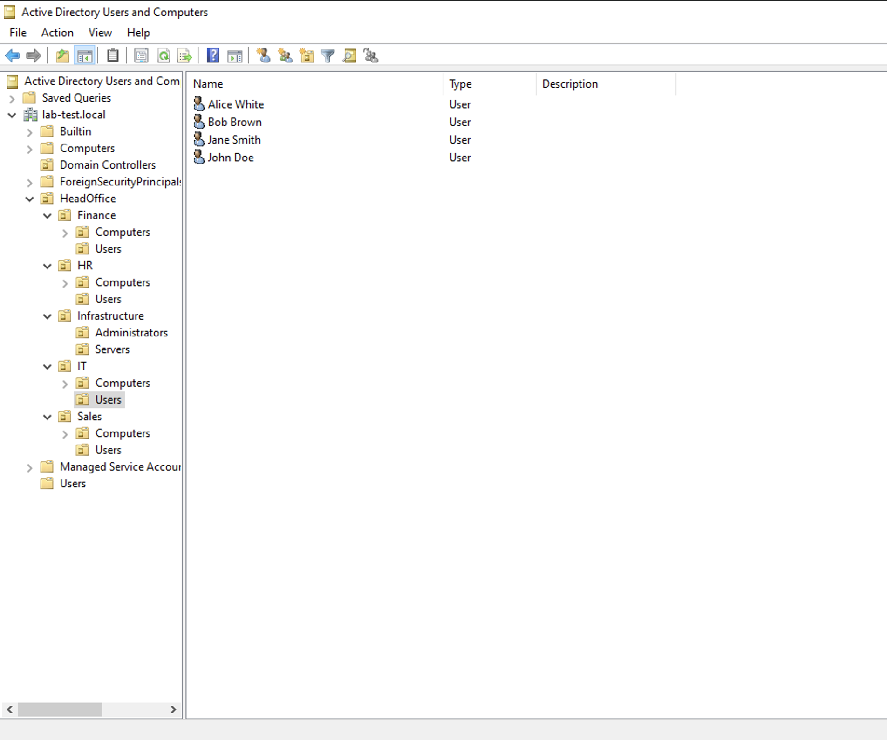
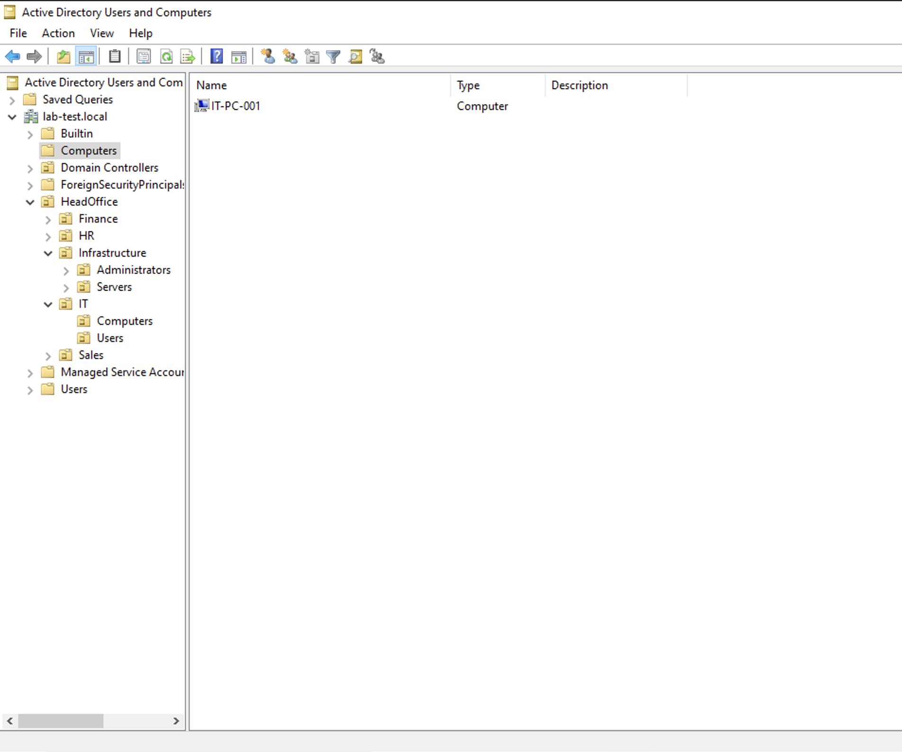
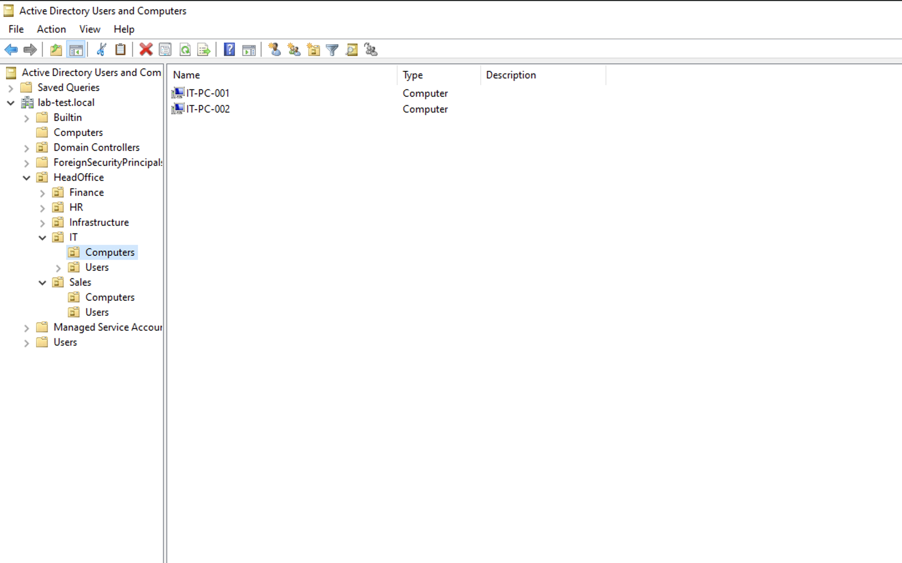

# Add Computers and Users to the Domain

## Move the Windows 10 appliances to the canvas

1. Move ten Windows 10 appliances to the GNS3 canvas.
2. Rename them appropriately (e.g., IT-PC-001, IT-PC-002, etc.).
3. Connect the appliances to the appropriate access switches based on their department:
	- IT PCs: Connect to Access-Switch-1 and Access-Switch-3 (VLAN 10).
	- Sales PCs: Connect to Access-Switch-1 (VLAN 20).
	- Finance PCs: Connect to Access-Switch-3 (VLAN 30).
	- HR PCs: Connect to Access-Switch-3 (VLAN 40).
4. Verify every connection on the relevant switches using the command: `ovs-vsctl show`.



## Create users

| **GivenName** | **Surname** | **SamAccountName** | **OU**                                                 |
| ------------- | ----------- | ------------------ | ------------------------------------------------------ |
| **John**      | Doe         | jdoe               | OU=Users,OU=IT,OU=HeadOffice,DC=lab-test,DC=local      |
| **Jane**      | Smith       | jsmith             | OU=Users,OU=IT,OU=HeadOffice,DC=lab-test,DC=local      |
| **Bob**       | Brown       | bbrown             | OU=Users,OU=IT,OU=HeadOffice,DC=lab-test,DC=local      |
| **Alice**     | White       | awhite             | OU=Users,OU=IT,OU=HeadOffice,DC=lab-test,DC=local      |
| **Michael**   | Johnson     | mjohnson           | OU=Users,OU=Sales,OU=HeadOffice,DC=lab-test,DC=local   |
| **Emily**     | Davis       | edavis             | OU=Users,OU=Sales,OU=HeadOffice,DC=lab-test,DC=local   |
| **David**     | Wilson      | dwilson            | OU=Users,OU=Sales,OU=HeadOffice,DC=lab-test,DC=local   |
| **Sarah**     | Miller      | smiller            | OU=Users,OU=Finance,OU=HeadOffice,DC=lab-test,DC=local |
| **Kevin**     | Taylor      | ktaylor            | OU=Users,OU=Finance,OU=HeadOffice,DC=lab-test,DC=local |
| **Olivia**    | Martinez    | omartinez          | OU=Users,OU=HR,OU=HeadOffice,DC=lab-test,DC=local      |

> [!NOTE]
> **Password for every account:** SecurePassword

## Bulk User Creation with PowerShell

You can use a CSV file and a PowerShell script to create these users in bulk.

1. **Create a CSV file** (e.g., `new-users.csv`) on the desktop of DC-01 with the following content (or download it):

	[new-users.csv](docs/new-users.csv)

2. **Create a PowerShell script** (e.g., `new-users-import.ps1`) on the desktop of DC-01 with the following content (or download it):

	[new-users-import.ps1](scripts/new-users-import.ps1)

3. **Open PowerShell as an administrator** on DC-01.
4. Navigate to the Desktop:
	``` sh
	cd Desktop
	```
5. Temporarily Allow Script Execution:To allow scripts for the current session only, run:
	``` sh
	Set-ExecutionPolicy -ExecutionPolicy Bypass -Scope Process
	```
6. Run the script:
	``` sh
	./NewUsersImport.ps1
	```

	

## Join the PC to the domain

### Method 1: GUI (Example: IT-PC-001)

1. Log in to the `IT-PC-001` appliance.
2. In the search bar, type "About your PC" and open the System settings.
3. Click "Rename this PC (advanced)".
4. Under the **Computer Name** tab, click **Change** on `IT-PC-001`
5. In the **Member of** section, select **Domain**.
6. Type `lab-test.local` and click **OK**.
7. Enter **Administrator credentials** (for the `lab-test.local` domain) when prompted.
8. Restart the PC when prompted.
9. After the reboot, log in with credentials from the CSV file (e.g., `lab-test\jdoe` and `SecurePassword`).

#### Verification (GUI Method)
1. On `DC-01`, open `dsa.msc` (Active Directory Users and Computers).
2. You should see `IT-PC-001` listed in the **Computers** container.
3. Move `IT-PC-001` to the appropriate OU: `HeadOffice/IT/Computers`.
	
	

### Method 2: PowerShell (Example: IT-PC-002)

1. On `DC-01`, open `dsa.msc`.
2. Pre-create the computer object: Navigate to `HeadOffice/IT/Computers`, right-click, select **New > Computer**, and name it `IT-PC-002`.
3. Connect to the `IT-PC-002` appliance via the console.
4. Open **PowerShell as Administrator**.
5.  Rename the computer and restart:
    ```powershell
    Rename-Computer -NewName IT-PC-002 -Restart
    ```
6. After rebooting, open **PowerShell as Administrator** again.
7.  Join the domain and restart:
    ```powershell
    Add-Computer -DomainName "lab-test.local" -Credential "lab-test.local\Administrator" -Restart
    ```
8. Enter the Administrator password when prompted.
9. After rebooting, log in with domain credentials (e.g., `lab-test\jsmith` and `SecurePassword`).

#### Verification
1.  On `DC-01`, open `dsa.msc` or Server Manager > Tools > Active Directory Users and Computers.
2.  Verify that `IT-PC-002` is present in the `HeadOffice/IT/Computers` OU.
	
	

## Resources and References
- Active Directory: https://learn.microsoft.com/en-us/windows-server/identity/ad-ds/get-started/virtual-dc/active-directory-domain-services-overview
- Rename-Computer: https://learn.microsoft.com/en-us/powershell/module/microsoft.powershell.management/rename-computer?view=powershell-7.4
- Add-Computer: https://learn.microsoft.com/en-us/powershell/module/microsoft.powershell.management/add-computer?view=powershell-7.4
- New-ADUser: https://learn.microsoft.com/en-us/powershell/module/activedirectory/new-aduser?view=windowsserver2022-ps