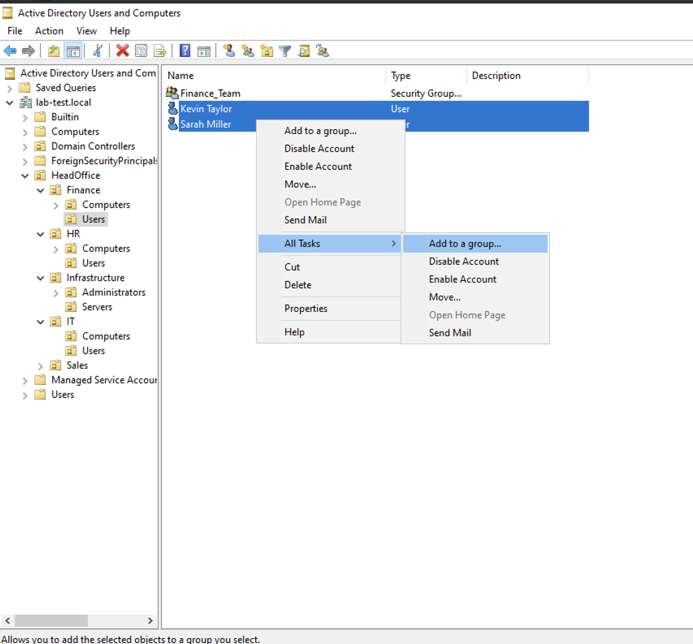
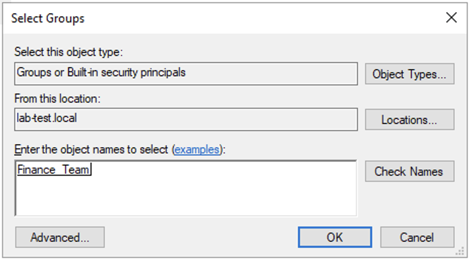
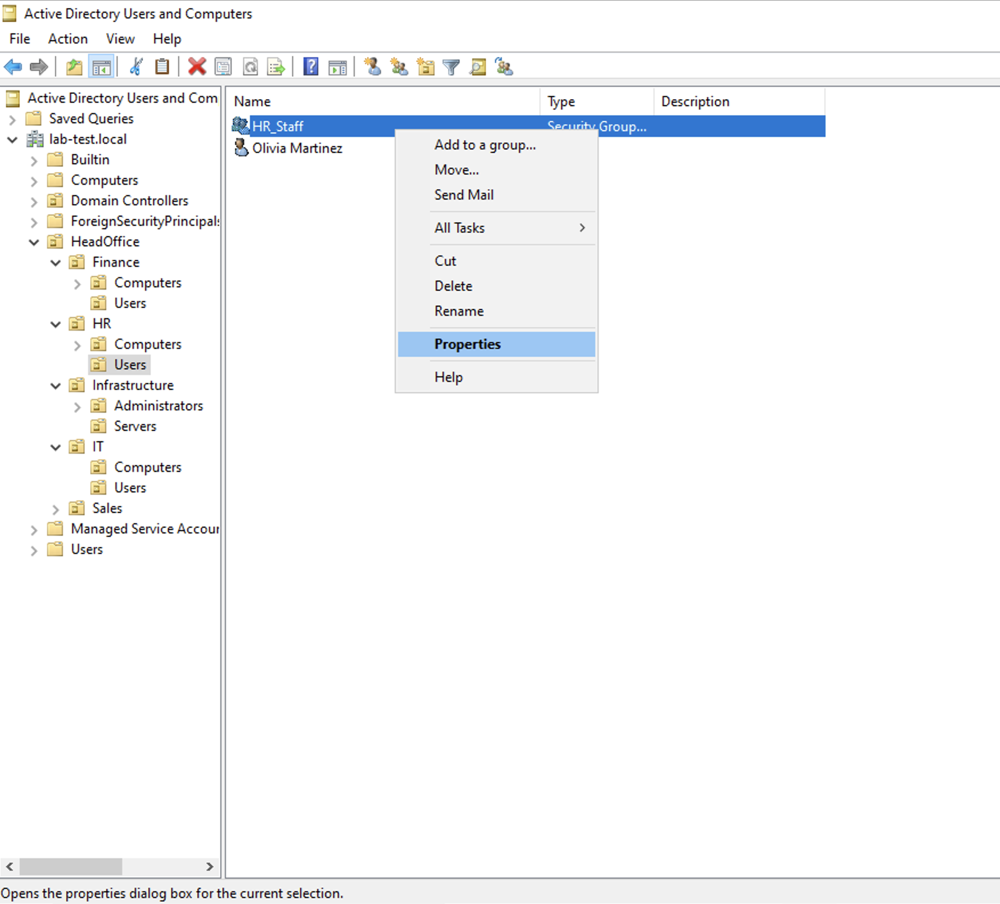
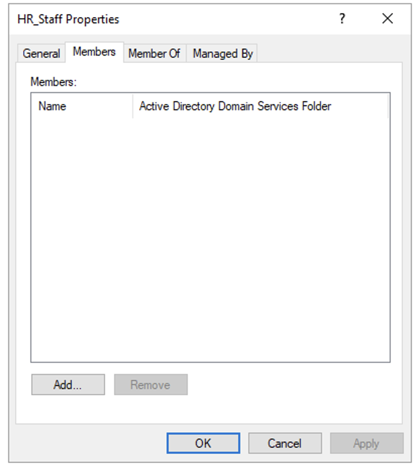
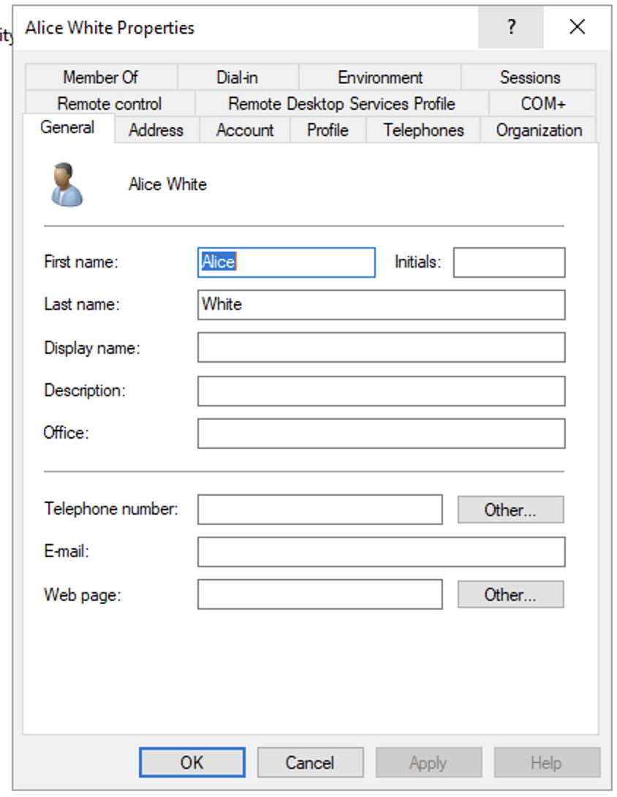

# Configure Active Directory Security Groups

## Creating Security Groups in AD

We will create the following groups:

- **Sales_Team:** Members of the sales team.
- **HR_Staff:** Members of the HR staff.
- **Finance_Team:** Members of the finance team.
- **IT_Users:** General IT users.
- **IT_Admins:** IT administrators.

### GUI

1. Open **Active Directory Users and Computers** (`dsa.msc`).
2. Go to the appropriate OU where you want to create the group. For example, to create the `Sales_Team` group, go to **HeadOffice > Sales > Users**.
3. Right-click the OU and select **New > Group**.
4. Enter the **Group name** `Sales_Team`.
5. Ensure **Group scope** is set to **Global** and **Group type** is set to **Security**.
6. Click **OK**.
7. Repeat steps 2-6 for each of the groups listed above, placing them in their respective OUs:
    - HR_Staff: **HeadOffice > HR > Users**
    - Finance_Team: **HeadOffice > Finance > Users**
    - IT_Users: **HeadOffice > IT > Users**
    - IT_Admins: **HeadOffice > Infrastructure > Administrators**

### PowerShell

You can use the following PowerShell script to create the groups. This script checks if a group already exists before attempting to create it:

[create-groups.ps1](scripts/create-groups.ps1)

## Add Users to Groups

We will assign users to various groups with different methods:

- **Kevin Taylor** and **Sarah Miller** to the Finance_Team group.
- **Olivia Martinez** to the HR_Staff group.
- **John Doe**, **Jane Smith**, and **Bob Brown** to the IT_Users group.
- **Alice White** to the IT_Admins group.

### GUI (Adding Users to a Group)

1. Open `dsa.msc`.
2. Navigate to the OU containing the users you want to add **HeadOffice > Finance > Users**.
3. Select the users you want to add to a group **Kevin Taylor** and **Sarah Miller**.
4. Right-click on the selected users and choose **Add to a group...**
5. In the **Enter the object names to select** box, type the name of the group `Finance_Team`.
6. Click **Check Names**. The name should resolve and become underlined.
7. Click **OK**.





### GUI (Adding Members to a Group's Properties)
1. Open `dsa.msc`.
2. Go to the OU containing the group you want to modify **HeadOffice > HR > Users**.
3. Right-click on the group HR_Staff and select **Properties**.
4. Go to the **Members** tab.
5. Click **Add...**
6. In the **Enter the object names to select** box, type the SAM of the user you want to add `omartinez`.
7. Click **Check Names**.
8. Click **OK**.






### GUI (Adding a User to Groups via User Properties)
1. Open `dsa.msc`.
2. Navigate to the OU containing the user you want to modify **HeadOffice > IT > Users**.
3. Right-click on the user **Alice White** and select **Properties**.
4. Go to the **Member Of** tab.
5. Click **Add...**
6. In the **Enter the object names to select** box, type the name of the group `IT_Admins`.
7. Click **Check Names**.
8. Click **OK**.



### PowerShell Method

1. Open **PowerShell** as an administrator.
2. Execute the command:
	``` sh
	Add-ADGroupMember -Identity "IT_Users" -Members jdoe, jsmith, bbrown
	```
3. **Verification:** You can verify group membership by checking the **Member Of** tab in a user's properties in `dsa.msc` or by using the `Get-ADGroupMember` command in PowerShell:
	``` sh
	Get-ADGroupMember -Identity "IT_Users"
	```

## Resources and References

- New-ADGroup: https://learn.microsoft.com/en-us/powershell/module/activedirectory/new-adgroup?view=windowsserver2022-ps
- Add-ADGroupMember: https://learn.microsoft.com/en-us/powershell/module/activedirectory/add-adgroupmember?view=windowsserver2022-ps
- Get-ADGroupMember: https://learn.microsoft.com/en-us/powershell/module/activedirectory/get-adgroupmember?view=windowsserver2022-ps
- Get-ADGroup: https://learn.microsoft.com/en-us/powershell/module/activedirectory/get-adgroup?view=windowsserver2022-ps
