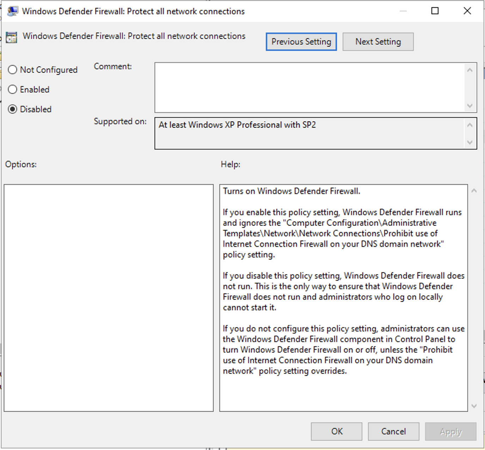
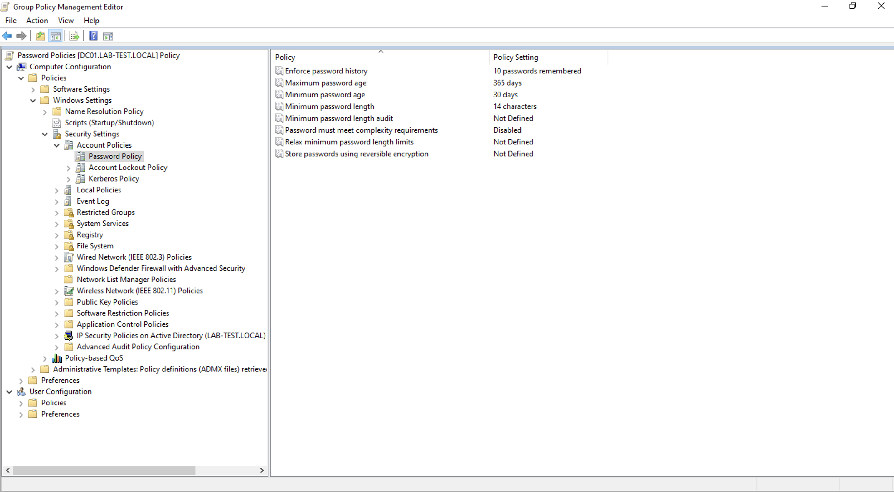
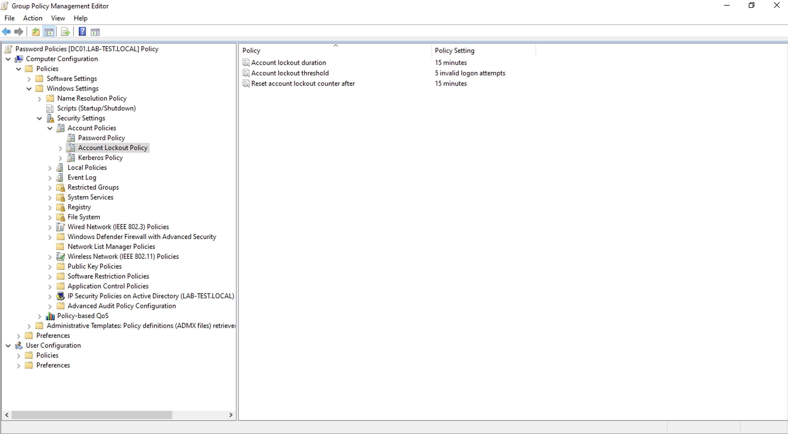

# Create Basic GPOs

## Block Firewall on Domain

This GPO disables the Windows Defender Firewall for computers within the `HeadOffice` OU.  This is for testing purposes and will be modified in the future.

1. Run `gpmc.msc` from the search bar on DC-01.
2. Right-click on the `HeadOffice` OU and select **Create a GPO in this domain, and Link it here.
3. **Name the GPO:**  `Block Firewall Domain`.
4. Right-click the newly created `Block Firewall Domain` GPO and select **Edit**.
5. Navigate to the Firewall Settings:
    - **Computer Configuration > Policies > Administrative Templates > Network > Network Connections > Windows Defender Firewall > Domain Profile.**
6. Configure the Firewall Setting:
    - Double-click **Windows Defender Firewall: Protect all network connections**.
    - Select **Disabled**.
    - Click **OK**.

	

## Password & Lockout Policies

This GPO configures password complexity, length, and account lockout settings for the entire `lab-test.local` domain.

1. Run `gpmc.msc` from the search bar.
2. Right-click on the `lab-test.local` domain and select **Create a GPO in this domain, and Link it here**
3. **Name the GPO:** `Password Policies`.
4. Right-click the `Password Policies` GPO and select **Edit**.
5. **Navigate to Password Policies:**
    - **Computer Configuration > Policies > Windows Settings > Security Settings > Account Policies.**
    - Select **Password Policy**.
6. Configure Password Policy Settings:
    * **Enforce password history:** `10 passwords remembered`
    * **Maximum password age:** `365 days`
    * **Minimum password age:** `30 days`
    * **Minimum password length:** `14 characters`
    * **Password must meet complexity requirements:** `Disabled`

    

7.  **Navigate to Account Lockout Policy:**
    * In the same `Account Policies` section, select **Account Lockout Policy**.
8.  **Configure Account Lockout Settings:**
    * **Account lockout duration:** `15 minutes`
    * **Account lockout threshold:** `5 invalid logon attempts`
    * **Reset account lockout counter after:** `15 minutes`

	

## VM Optimization

This GPO applies various settings to optimise the performance VM-instances.

1. Run `gpmc.msc`.
2. Right-click on the `HeadOffice` OU and select **Create a GPO in this domain, and Link it here**.
3. **Name the GPO:** `Optimisation VM`.
4. Right-click the `Optimization VM` GPO and select **Edit**.
5. Configure the Following Settings:
    -   **Do not display the lock screen:**
        - Computer Configuration > Policies > Administrative Templates > Control Panel > Personalization
        - **Do not display the lock screen** > `Enabled
    *   **Show clear logon background:**
        * Computer Configuration > Policies > Administrative Templates > System > Logon
        * **Show clear logon background** > `Enabled
    *   **Start background and animations:**
        - Computer Configuration > Policies > Administrative Templates > Windows Components > Desktop Window Manager
        - Use solid color for Start background: `Enabled
        - **Do not allow window animations**: `Enabled`
    *   **Allow Cortana:**
        - Computer Configuration > Policies > Administrative Templates > Windows Components > Search
        - **Allow Cortana** > `Disabled`
    *   **OneDrive:**
        - Computer Configuration > Policies > Administrative Templates > Windows Components > OneDrive
        - **Prevent the usage of OneDrive for file storage** > `Enabled
    *   **Microsoft Defender Antivirus:**
        - Computer Configuration > Policies > Administrative Templates > Windows Components > Microsoft Defender Antivirus
        - **Turn off Microsoft Defender Antivirus** > `Enabled
    *   **Real-Time Protection:**
        - Computer Configuration > Policies > Administrative Templates → Windows Components > Microsoft Defender Antivirus > Real-Time Protection
        - **Turn off real-time protection** > `Enabled`

## Force GPO Update

To ensure the newly created GPOs are applied immediately, run the following command in an elevated PowerShell prompt on a client machine (or on DC-01 to apply to the server itself):

```sh
gpupdate /force
```

This command forces an immediate update of all Group Policy settings.  Clients will also update their policies automatically at regular intervals (by default, every 90 minutes). Also, you can reboot the PC to apply changes.

## Resources and References

- Group Policy Overview: https://learn.microsoft.com/en-us/windows-server/identity/ad-ds/manage/group-policy/group-policy-overview
- gpupdate: https://learn.microsoft.com/en-us/windows-server/administration/windows-commands/gpupdate
