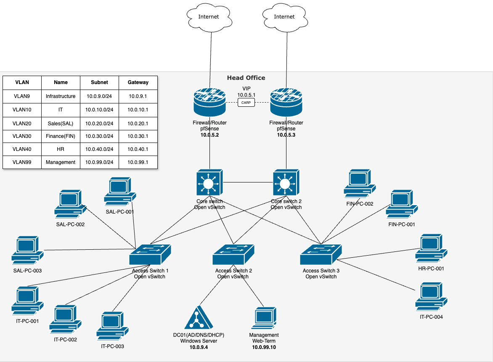

# Hybrid Office Data Center GNS3 Lab

I have created a GNS3 lab to develop and enhance my system administration skills. My approach is to start with a foundational setup and gradually integrate more advanced technologies.

Initially, I aim to create a small office with reliable core infrastructure and minimal appliances, focusing on essential networking and system administration concepts. I plan to expand it by imitating a data center site and adding a small branch office. 

## Current Topology

## Objectives

| **#** | **Topic**                                                                          | Objectives                                                                                                                                                                                                                                                         | **Status** |
| ----- | ---------------------------------------------------------------------------------- | ------------------------------------------------------------------------------------------------------------------------------------------------------------------------------------------------------------------------------------------------------------------ | ---------- |
| 1     | [Deploy a Virtualised Lab Environment on Cloud](01_environment_setup.md)           | - Deploy a Cloud VM with GNS3. - Enable nested virtualisation for running virtual appliances. - Install essential dependencies for GNS3, including QEMU and Docker.                                                                                          | Completed  |
| 2     | [Configure GNS3 and appliances for network simulation](02_configure_gns3.md)       | - Deploy Network Appliances Open vSwitch, pfSense, and WebTerm - Configure Windows VM templates for Windows 10 and Windows Server 2022. - Optimise Windows VMs with Guest Tools.                                                                             | Completed  |
| 3     | [Install and Configure pfSense Firewall](03_install_pfsense.md)                    | - Add pfSense and Cloud NAT to the GNS3 canvas.                                                                                                                                                                                                                    | Completed  |
| 4     | [Configure pfSense for High Availability & VLAN Trunking](04_configure_pfsense.md) | - Assign IP to LAN interface. - Configure Web-Term access. - Configure SYNC port. - Set up High Availability. - Create CARP VIP on LAN (10.0.5.1). - Create trunk parent interface. - Create VLAN interfaces. - Create CARP VIP for each VLAN | Completed  |
| 5     | [Create and configure MGMT_VLAN](05_configure_mgmt_vlan.md)                        | - Create a new VLAN (VLAN 99). - Create a CARP VIP on VLAN_MGMT.                                                                                                                                                                                                | Completed  |
| 6     | [Set up Permissive Firewall Rules](06_set_up_firewall_rules.md)                    | - Create an Interface Group. - Add a Firewall Rule                                                                                                                                                                                                              | Completed  |
| 7     | [Deploy and Configure Switches ](07_switch_configuration_deployment.md)            | - Deploy Core and Access Switches. - Enable STP for Redundancy. - Configure VLAN Trunks and Access Ports. - Interconnect Switches. - Configure Web-term Static IP. - Disable MGMT Interface of pfSense                                              | Completed  |
| 8     | [Deploy DC-01](08_dc_01_deployment.md)                                             | - Rename the Server. - Install Active Directory Domain Services (AD DS). - Promote to Domain Controller.                                                                                                                                                     | Completed  |
| 9     | [Configure DHCP Server and DHCP Relay](09_configure_dhcp.md)                       | - Install the DHCP Server. - Create DHCP Scopes. - Configure DHCP Relay on pfSense                                                                                                                                                                           | Completed  |
| 10    | [DNS Forwarding Setup (DC01)](10_dns_forwarding_setup.md)                          | - Configure Forwarders in Windows DNS. - Update DNS Settings on DC01.                                                                                                                                                                                           | Completed  |
| 11    | [Organisational Units Setup](11_ou_setup.md)                                       | - Create OUs                                                                                                                                                                                                                                                       | Completed  |
| 12    | [Add Computers and Users to the Domain](12_add_pcs_users_to_domain.md)             | - Deploy Windows 10 Appliances. - Create Users. - Join PCs to the Domain.                                                                                                                                                                                    | Completed  |
| 13    | [Add Security Groups in Active Directory](13_add_security_groups.md)               | - Create Security Groups. - Add Users to Groups.                                                                                                                                                                                                                | Completed  |
| 14    | [Create Basic GPOs](14_create_basic_gpos.md)                                       | - Password & Lockout Policies. - Optimisation VM.                                                                                                                                                                                                               | Completed  |
## Failover tests

## Repository Structure

## Resources & References

- GNS3 Official Documentation: https://docs.gns3.com/
- Microsoft Learn (Active Directory & Windows Server): https://learn.microsoft.com/en-us/windows-server/
- pfSense Documentation: https://docs.netgate.com/pfsense/en/latest/
- Open vSwitch Documentation: https://docs.openvswitch.org/

## Contact

## License

[MIT License](LICENSE)
